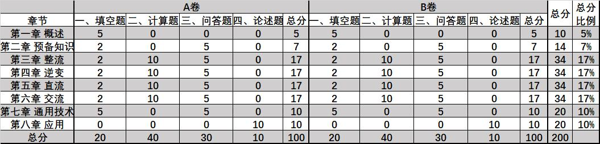

# 重点

- 正激和反激
- 论述题要画主电路图，不是画框图，关注四大变换的具体应用
- 关注不同控制策略下逆变器的工作波形（作图）

# 题型

- 

- 绝大部分题目电路图会给

- 填空
  - 有简单计算，且会考察对知识点的理解，对知识点的理解应用，书上没有原文

- 计算题
  - 整流：只考电阻和阻感负载，不考反电动势；不考全控计算，要懂原理；阻感特殊情况
	  - 可控整流器：单相or三相
  - 逆变：电压型逆变器，关注不同控制策略下电压型逆变器的工作原理；z源不考
  - DC-DC：关注正激变换器和反激变换器的工作原理和推导
  - AC-AC：交流调压器（只考单相）；单相调压器的电压电流公式的通式需要记忆
  - 作图题会给出波形基准

- 问答

  - 关注课后习题，如性能相似的变换器对比

- 论述题

  - 要求画出主电路图，而不是框图，关注四大变换的具体应用

- 不考

  - 参数选择
  - 纹波
  - 印象中没出SVPWM计算
- 考
  - 调制出波形计算基波参数
  - 傅里叶变换要记一下
- Chapter 7 关注思路，不必记具体电路

# 2019电力电子技术复习重点

#### 第 1 章 绪论

1）电力电子技术的定义，与信息电子技术的区别。电力变换的分类。电力电子技术的两个分支。电力电子器件的分类，以及相应电力电子电路的主要控制方式。

#### 第 2 章 电力电子器件

1）全控型器件、半控型器件、不可控器件的电气图形符号。电力电子器件在实际应用中的系统组成。如何使全控、半控型器件导通或关断，器件导通时器件的伏安特性（在电路中等效成$R_{ds}$还是$V_{ce}$）以及电流能否反向流过主沟道，器件关断时能否承受反向电压。电力二极管的主要类型及特点。

#### 第 3 章 整流电路

**1）计算与画图：单相半波可控整流、单相桥式全控整流、单相全波可控整流、三相半波可控整流、三相桥式全控整流的计算与关键波形绘制（参考课本习题，但不涉及变压器漏感的计算）。**
2）上述整流电路的移相范围，晶闸管所承受的最大正向、反向电压。
3）单相全波可控整流电路和单相桥式全控整流电路的对比，以及第5章中用到的全波整流电路和全桥整流电路的对比。
4）变压器漏感的概念和影响。
5）谐波和功率因数的定义。相控式整流电路和斩控式（PWM）整流电路在谐波和功率因数方面的对比。
6）有源逆变的概念，和第4章的逆变电路有什么区别。

#### 第 4 章 逆变电路

**1）计算与画图：半桥逆变、全桥逆变、三相桥式逆变的电路结构、控制（调压）方法和关键波形、输出电压的计算、输出电平的种类。（可以与第7章中逆变电路的PWM控制进行对比学习）。**
2）半桥逆变与全桥逆变电路的对比。
3）电压型和电流型逆变电路各自的特点。

#### 第 5 章 直流—直流变流电路

**1）计算与画图： Buck、Boost、Back—Boost电路的工作原理、关键波形、计算（不考虑寄生电阻）。可能需要使用伏秒平衡或安秒平衡的进行分析。**
3） 6种基本DC—DC电路的工作原理和对比（电压增益、输出极性、输入输出电流纹波）。
4） 5种隔离型DC—DC电路的电路结构、工作原理、电压增益和器件承受的最大电压。双端电路中，原边电路（推挽和全桥）的对比，副边所用整流电路（全波和全桥）的对比。

#### 第 6 章 交流—交流变流电路。

**1）计算：单相交流调压电路的计算（参考课本习题）。**
2）交流—交流变流电路的分类。直接方式与间接方式的区别。.3）单相交流调压电路与斩控式交流调压电路的工作原理对比。
4）单相交—交变频电路的电路构成和基本工作原理、整流与逆变工作状态。如何调节输出 电压的频率，输出电压频率的上限是多少（对比间接方式的交—直—交变频电路）。

#### 第 7 章 PWM 控制技术

1） PWM 控制的定义和理论基础（面积等效原理）。
2） PWM控制的实现方法对比（计算法、调制法、跟踪控制法）。在调制法中，按载波极性可如何分类，按载波频率可如何分类；为什么通过比较载波和调制波就能够实现面积等效原理。
3）逆变电路： PWM控制方式与基本工作方式的对比，包括电路波形、输入输出关系（调压方法）、输出电平、输出谐波的对比。负载对输出波形的影响。
4）整流电路： PWM整流电路与PWM逆变电路的联系， PWM整流电路与相控式整流电路的对比（谐波和功率因数）。

#### 第 8 章 软开关技术

1）为什么要引入软开关技术。
2）软开关电路的定义（基本特征、作用）。
3）软开关过程的分类（ZCS和ZVS）、作用与电压电流波形图。
4）软开关电路按发展历程的分类和各自特点。

#### 第9章 电力电子器件应用的共性问题

1）缓冲电路的分类、电路结构、工作原理和作用。
2）电力电子器件的串并联使用。

#### 第 10 章 电力电子技术的应用

1）SVG、APF 的电路结构与功能
2）PFC 电路的功能。