# 复习思考题

## Chapter 1 

1. 什么是电力系统？什么是电力网？它们都由哪些设备组成？
   1. 生产、输送、分配和消费电能的各种电气设备连接在一起而组成的整体称为**电力系统**
   2. 电力系统中输送和分配电能的部分称为**电力网**，包括升压变压器、降压变压器和各种电压等级的数输电线路
2. 电力网的额定电压是怎样规定的？电力系统各类元件的额定电压与电力网的额定电压有什么关系？
   - **电力线路**的额定电压和系统的额定电压相等
   - **发电机**的额定电压与系统的额定电压为同一等级时高$5\%$
   - **变压器**的额定电压
     - **一次绕组**的额定电压与系统的额定电压相等，直接与发电机连接时与发电机的额定电压相等
     - **二次绕组**的额定电压比系统的额定电压高10%，直接与用户联接时比系统的额定电压高5%
   - **分接头**
3. 升压变压器和降压变压器的分接头是怎样规定的？变压器的额定变比与实际变比有什么区别？
   - 对于+5%抽头，升压变压器的抽头额定电压是$(220*1.1)*5\%=254V$，降压变压器的抽头额定电压是$220*1.05=231V$
   - 存在误差；变压器高压侧有分接头
4. 电能产生的主要特点是什么？对电力系统运行有那些基本要求？
   - 电能产生的主要特点 / 电力系统运行的特点
     1. 电能不能大量储存
     2. 电力系统的暂态过程非常短促
     3. 与国民经济的各部门及人民日常生活有着极为密切的关系
   - 基本要求：**安全、优质、经济、环保**
      1. 保证安全可靠的供电
      1. 要有合乎要求的电能质量
      1. 要有良好的经济性
      1. 尽可能减小对生态环境的有害影响
5. 根据供电可靠性的要求，电力系统负荷可以分为哪几个等级？各级负荷有何特点？
   - 目前我国将负荷分为三级
     - 第一级负荷
     - 第二级负荷
     - 第三级负荷
6. 电能质量的基本指标是什么？
   - **电压**：用户供电电压的允许偏移对于35kV及以上电压级为额定电压的$\pm 5\%$，对于10kV以下电压级为额定值的$\pm 7\%$
   - **频率**：工频$50Hz$，正常运行时允许的偏移为$\pm 0.2\sim\pm0.5Hz$
   - **电压正弦波形畸变率**
7. 电力网的接线方式中，有备用接线和无备用接线，各有什么特点？
   - **无备用接线**：每一个负荷只能靠一条线路取得电能
     - 包括：放射式、干线式、树状式
     - 无备用接线只适用于向第三类负何供电
     - 优点：简单，设备费用少，运行方便
     - 缺点：供电可靠性较差，任一线路检修或故障时都需要中断用户的供电
   - **有备用接线**：每一个负荷可以靠多条线路取得电能
     - 包括：双回放射式、双回干线式、环网、两端供电式
     - 有备用接线适用于第一类和第二类负荷供电
     - 优点：简单，运行方便，供电可靠性和电压质量明显提高
     - 缺点：设备费用增加
8. 什么是开式网络？什么是闭式网络？它们各有何特点？
   - **开式网络**：每一个负荷都只能沿唯一的路径取得电能的网络
   - **闭式网络**：每一个负荷点至少通过两条线路从不同方向取得电能
9. 你知道各种电压等级单回架空线路的输送功率何输送距离的适宜范围吗？*

## Chapter 2

1. 在电力网计算中，单位长度输电线路常采用哪种等值电路？等值电路有哪些主要参数？这些参数各反映什么物理现象？
   1. 实际计算中大多采用 **$\pi$ 形电路**代表输电线
   2. 线路的传播常数$\gamma$，线路的波阻抗$Z_c$
2. 何谓一相等值参数？
   - 电力系统是以三相交流为主体，一般在正常运行时三相系统是对称的，及三相电压电流对称，三相网络元件对称，三相参数相同，三相电压和电流的有效值相同，因此在分析时用单相电路进行计算，输电线路的参数为一相等值参数。
3. 什么是导线的自几何均距？它与导线的计算半径有什么关系？分裂导线的自几何均距又是怎样计算的？
   - 自几何间距是计及导线内部电感的等值半径*
   - 圆柱形导线的自几何间距$D_s=re^{-\frac{1}{4}}$
   - 分裂导线的自几何间距与分裂间距及分裂根数有关
     - 设分裂根数为n，有$D_{sb}=\sqrt[n]{D_sd^{n-1}}$，其中$D_s$为每根多股绞线的自几何间距

4. 架空线路的导线换位有什么作用？
   - 当三相导线排列不对称时，各相线路所交链的磁链及各相等值电感便不相同，这将引起三相参数不对称。
   - 利用导线换位使三相恢复对称
5. 什么是三相线路的互几何均距？它是怎样计算的？
   - 等边三角形排列：$D_{eq}=\sqrt[3]{D_{12}D_{23}D_{31}}$
   - 水平排列：$D_{eq}=\sqrt[3]{DD2D}=1.26D$

6. 分裂导线对线路的电感和电容各有什么影响？
   你知道各种不同结构的架空线（单导线，2分裂，3分裂和4分裂导线）每千米的电抗和电纳的大致数值吗？*
   - 分裂导线可以增大等值半径，从而提高电晕临界电压，减小电晕损耗、减小电抗、增大电纳。

7. 在电力网计算中两绕组和三绕组变压器常采用哪种等值?
   - 双绕组变压器的近似等值电路常将励磁支路前移到电源侧，将二次绕组的电阻和漏抗折算到一次绕组侧并和一次绕组的电阻和漏抗合并
   - 三绕组变压器采用励磁支路前移的星形等效电路

8. 怎样利用变压器的铭牌数据计算变压器等值电路的参数？
   - 变压器的主要参数：电阻$R_T$、电抗$X_T$、电导$G_T$、电纳$B_T$、变压比$K_T$
   - 铭牌参数：短路损耗$\Delta P_S$、短路电压$U_S\%$、空载损耗$\Delta P_0$、空载电流$I_0\%$
   - $\displaystyle R_T=\frac{\Delta P_SU_N^2}{S_N^2}\times10^3\ohm$
   - $\displaystyle X_T=\frac{U_S\%}{100}\times\frac{U_N^2}{S_N}\times10^3\ohm$
   - $\displaystyle G_T=\frac{\Delta P_0}{U_N^2}\times10^{-3}S$
   - $\displaystyle B_T=\frac{I_0\%}{100}\times\frac{S_N}{U_N^2}\times10^{-3}\ohm$

9. 在计算绕组容量不等的三绕组变压器的电阻和电抗时要注意什么问题？
10. 变压器的变压比是如何定义的？它与原、副方绕组的匝数比有何不同？
11. 为什么变压器的口型等值电路能够实现原、副方电压和电流的变换？
12. 什么是标么制？采用标幺制有什么好处？
    1. 在一般的电路计算中，电压、电流、功率和阻抗的单位分别用V，A，W，Ω表示，这种用实际有名单位表示物理量的方法称为**有名单位制**
    2. **标幺制**就是把各个物理量均用标幺制来表示的一种相对单位制。标幺制（per unit）电路计算中各物理量和参数均以其有名值与基准值的比值表示的无量纲体制
    3. 采用标幺制的优点：
       1. 易于比较电力系统各元件的特性及参数、简化计算公式、简化计算工作

13. 三相电力系统中基准值是怎样选择的？

    - 电力系统中，主要涉及对称三相电路的计算，习惯上采用线电压$U$、线电流（即相电流）$I$、三相功率$S$和一相等值阻抗$Z$

    - $$
      \left\{\begin{matrix}
      U_B=\sqrt{3}Z_BI_B=\sqrt{3}U_p \\
      S_B=\sqrt{3}U_BI_B=3U_{p\cdot B}I_B=3S_{p\cdot B}
      \end{matrix}\right.
      $$

    - **基准容量**、**基准电压**、基准电流、基准电抗

14. 不同基准值的标幺值之间是怎样进行换算的？
15. 在多级电压网络中，各电压级的基准电压是怎样选择的？能避免出现非基准变比变压器吗？

## Chapter 3

1. 什么是理想化同步电机？
   - 采用以下简化假设：
     1. 忽略磁路饱和、磁滞、涡流等的影响，假设电机铁芯部分的导磁系数为常数；
     2. 电机转子在结构上对于纵轴和横轴分别对称；
     3. 定子的$a、b、c$三相绕组的空间位置相差120°电角度，在结构上完全相同，它们均在气隙中产生正弦分布的磁动势；
     4. 电机空载，转子恒速旋转时，转子绕组的磁动势在定子绕组所感应的空载电势是时间的正弦函数；
     5. 定子和转子的槽和通风沟不影响定子和转子的电感，即认为定子和转子表面光滑
   - 符合上述条件的电机称为理想同步电机

2. 同步电机定子绕组和转子绕组的自感系数和互感系数中哪些系数同转子的位置角有关？它们都有怎样的变化规律？
   - 定子绕组的自感系数是转子位置角的周期函数，周期为 $\pi$ ;
   - 定子各相绕组间的互感系数是转子位置角的周期函数，周期为 $\pi$ ;
   - 转子绕组的自感系数是常数；
   - 转子各相绕组间的互感系数是常数；
   - 定子绕组和转子绕组间的互感系数是转子位置角的周期函数，周期为 $2\pi$ ;

3. 在同步发电机的稳态运行分析中是怎样处理电枢反应的？这样处理有什么好处？
   - 采用双反应理论把电枢磁势分解为纵轴分量和横轴分量，避免了在同步电机稳态分析中出现变参数的问题

4. 为什么采用$d、q、0$坐标系可以解决定子、转子绕组磁链方程中的变系数问题？

   - 通过变换，将三相电流$i_a$、$i_b$、$i_c$转换成了等效的两相电流$i_d$和$i_q$。实际的$a、b、c$三相绕组在空间中静止不动，等效的定子绕组$dd$和$qq$随着转子一起旋转，对转子相对静止，所遇到的磁路磁阻恒定不变，使相应的电感系数变为常数。

5. $d、q、0$坐标下的直流分量和基频分量分别与a、b、c坐标系的什么分量相对应？为什么？

   - $d、q、0$坐标系下的直流分量和基频分量分别和$a、b、c$坐标系下的基频分量和直流分量相对应
   - $$
     \begin{pmatrix}
     i_q \\
     i_q \\
     i_0
     \end{pmatrix}
     =
     \frac{2}{3}
     \begin{pmatrix}
     \cos\alpha & \cos{(\alpha-120^{\circ})} & \cos{(\alpha+120^{\circ})} \\
     \sin\alpha & \sin{(\alpha-120^{\circ})} & \sin{(\alpha+120^{\circ})} \\
     \frac{1}{2} & \frac{1}{2} & \frac{1}{2} 
     \end{pmatrix}
     \begin{pmatrix}
     i_a \\
     i_b \\
     i_c
     \end{pmatrix}
     $$

     

6. 不对称三相正弦变量进行$d、q、0$坐标变换会得到什么结果？
   如果（1）三相量中含零序分量，（2）三相量中含负序分量，则又有什么结果？

   - 

7. 在$d、q、0$坐标系的定子电势方程中，定子电势由哪些分量组成？这些电势分量是怎样产生的？

   - 在$d、q、0$坐标系的定子电势方程中定子电势分别由变压器电势和发电机电势构成；

   - 变压器电势是由$d、q、0$假想绕组磁链变化产生的，发电机电势是由$d、q$假想绕组导线分别切割q、和d轴向磁场磁力线产生的。

8. 在$d、q、0$坐标系的磁链方程中，是什么原因使定子、转子绕组间的互感系数变得不具有互易性？可以用什么方法来解决这个问题？

9. 在同步电机基本方程中采用标么制时，定、转子有关变量的基准值是怎样选择的？*

10. 什么叫运算电抗？你能作出运算电抗的等值电路吗？

11. 在实际应用同步电机基本方程时，常采用哪些简化假设？这些假设忽略了什么因素？给计算带来哪些方便？其适用范围怎样？

12. 什么是实用正向？为什么要对同步电机基本方程中部分变量的假定正向进行调整？
    1. 改选转子$d$轴的负方向作为定子电压（电势）、电流的d轴分量的正方向，而其余各量的正方向不变。调整后各变量的正方向称为**实用正向**
    2. 为了使定子电压和电流的d轴分量常有正值，并与习惯的用法一致
    	1. 同步发电机在实际运行中常带感性负载，定子端电压相量 $\dot U$ 和电流向量 $\dot I$ 都落后与电势相量 $\dot E_q$ ，因此定子电压和电流的d轴分量将位于转子d轴的反方向。

13. 试作出凸极发电机稳态运行时的电势相量图。
    - 
    - 图中$d$轴为实用正向

14. 什么叫假想电势$\dot E_Q$？它是怎样计算的？有什么用处？
    1. 为了能用一个等值电路来代表凸极同步电机，虚拟一个计算用的电势 $\dot E_Q$ ，且有 $\dot E_Q=\dot E_q-j(x_d-x_q)\dot I_d$ 
    2. $\dot E_Q=\dot U+jx_q\dot I$ ，实际的凸极机被表示为具有电抗 $x_q$ 和电势 $\dot E_Q$ 的等值隐极机，即等值隐极机法
    3. 真正的隐极机有$x_d=x_q$，此时$\dot{E}_q=\dot{E}_Q$

### 补充

- 参数符号名称
  - $x_d$ 同步电机纵轴同步电抗
  - $x_q$ 同步电机横轴同步电抗
  - $x_{od}$ 同步电机纵轴电枢反应电抗
  - $x_{oq}$ 同步电机横轴电枢反应电抗
- 

## Chapter 4

1. 为什么在电力系统分析计算中常采用节点方程？节点分析法有什么优点？
   1. 节点方程以母线电压为待求量，母线电压能唯一地确定网络的运行状态。知道了母线电压，就很容易算出母线功率、支路功率和电流。在潮流计算和短路计算中，节点方程的求解结果都极便于运用。

2. 怎样形成节点导纳矩阵？它的元素有什么物理意义？
   1. 自导纳$Y_{ii}$是节点i以外的所有节点都接地时节点$i$对地的总导纳
   2. 节点$k、i$之间的互导纳是从节点i流入网络的电流与施加于节点$k$的电压之比，节点$i$的电流实际上是自网络流出并进入地中的电流

3. 节点导纳矩阵有哪些特点？
   1. 导纳矩阵的元素很容易根据网络接线图和支路参数直观地求得
   2. 导纳矩阵是稀疏矩阵。它的对角线元素一般不为零，但非对角线元素中存在不少零元素。

4. 支路间存在互感时，怎样计算节点导纳矩阵的相关元素？*
5. 怎样用高斯消去法简化网络？
6. 用高斯消去法求解网络方程与通过网络的星网变换消去节点存在什么关系？
   - 高斯消去法实际上就是带有中心节点电流移置的星网变换

7. 形成节点阻抗矩阵的方法有哪些？
   1. 支路追加法
   2. 节点导纳矩阵求逆

8. 节点阻抗矩阵的元素有什么物理意义？
   1. 节点k的自阻抗$Z_{kk}$：当在节点$k$单独注入电流，而所有其他节点的注入电流都为$0$时，在节点$k$产生的电压与注入电流之比
   2. 节点$k$和节点$i$之间的互阻抗$Z_{ik}$：在节点$i$产生的电压与节点$k$的注入电流之比

9. 节点阻抗矩阵有哪些特点？为什么节点阻抗矩阵一般是满阵？
   1. 阻抗矩阵没有零元素，是一个满矩阵
   2. 电力网络一般是连通的，网络的各部分之间存在这电的或磁的联系。单独在节点k注入电流，总会在任一节点i出现电压。

10. 追加树支时怎样修改节点阻抗矩阵？追加连支时怎样修改节点阻抗矩阵？*
11. 怎样利用导纳型节点方程计算节点阻抗矩阵的一列元素？这个算法有什么物理意义？*
12. 为什么要对节点编号顺序进行优化？优化编号的原则是什么？*

## Chapter 5

1. 发生短路的主要原因有哪些？三相系统中可能发生哪些类型的短路？短路有什么后果？
   1. 发生短路的主要原因有：
      1. 元件损坏
      2. 气象条件恶化
      3. 违规操作
      4. 其他，鸟兽跨接在裸露的载流部分等

   2. 三相系统中可能发生以下类型的短路：
      1. 三相短路
      2. 两相短路
      3. 两相短路接地
      4. 单相接地短路

   3. 短路的后果有以下几个方面：
      1. 短路故障使短路点附近的支路中产生比正常值大许多倍的电流
      2. 短路电流使设备发热增加，短路持续时间较长时，可能导致设备过热损坏
      3. 短路时系统电压大幅下降
2. 短路计算的主要目的是什么？
   - 解决下列问题
     1. 选择有足够机械稳定度和热稳定度的电气设备
     2. 为了合理地配置各种继电保护和自动装置并正确整定其参数
     3. 设计和选择发电厂和电力系统电气主接线时，为了比较各种不同方案的接线图，确定是否需要采取限制短路电流的措施等
     4. 进行电力系统暂态稳定计算
3. 什么叫短路的合闸角？它与自由电流有什么关系？
   1. $\alpha$是电源电势的初始相角，即$t=0$时的相位角，亦称合闸角
   2. 
4. 什么叫短路冲击电流？计算冲击电流的目的是什么？怎样计算冲击系数？
   1. 短路电流最大可能的瞬时值称为**短路冲击电流$i_m$**
   2. 冲击电流主要用来校验电气设备和载流导体的电动力稳定度
   3. 冲击系数$k_{im}=1+exp(-0.01/T_a)$
      - 当短路发生在发电机电压母线时，取$k_{im}=1.9$；
      - 短路发生在发电厂高压侧母线时，取$k_{im}=1.85$；
      - 在其他地点短路时，取$k_{im}=1.8$
5. 什么叫短路电流最大有效值？它是怎样计算的？
   1. 在短路过程中，任一时刻$t$的短路电流有效值$I_t$是指以时刻$t$为中心的一个周期内瞬时电流的均方根值
   2. 短路电流的最大有效值出现在短路后的第一个周期
   3. $I_{im}=I_p\sqrt{1+2(k_{im}-1)^2}$，其中短路电流$I_p$为周期分量有效值，$k_{im}$为冲击系数
6. 什么叫短路功率（或短路容量）？它是怎样计算的？有什么用处？
   - **短路功率/短路容量**等于短路电流的最大有效值与短路处的正常工作电压（平均额定电压）的乘积
   - $S_{im}=\sqrt{3}U_{av}I_{im}$
   - 主要用来校验开关的切断能力
7. 同步电机突然短路时的电枢反应与稳态进行时的电枢反应有何不同？
8. 同步电机突然短路的暂态过程与恒电势源电路突然短路的暂态过程有何不同？
9. 什么叫磁链守恒原则？
   - 任何闭合线圈在运行状态变化的瞬间，都应该维持磁链不变
10. 试应用磁链守恒原则分析无阻尼绕组同步电机突然短路的暂态过程，说清楚定、转子绕组电流中出现各种分量的原因。
    - 同步发电机突然短路后，定子电流中包括基频分量、直流分量和倍频分量，直流分量和倍频分量都是为了维持磁链初值守恒而出现的，是自由分量，基频电流的稳态值是强制分量，基频电流与稳态电流之差也是自由电流。转子各绕组中出现直流和基频自由电流，直流电流包括励磁电流（强制分量）和自由直流。定子电流的基频自由电流与转子电流的自由直流对应，转子的基频交流与定子的非周期电流和倍频电流对应。

11. 什么是暂态电势$E_q^\prime$？它有什么特点？有什么用处？
12. 什么是暂态电抗？它与无阻尼绕组同步电机的运算电抗有什么关系？可用什么等值电路来计算它？
    - 同步发电机纵轴暂态电抗为$x_d^{\prime}$，其物理意义是沿纵轴向把同步电机看做是双绕组变压器，当副方绕组（即励磁绕组）短路时，从原方（即定子绕组）测得的电抗。

13. 怎样根据磁链平衡方程确定无阻尼绕组同步电机突然短路时定、转子绕组中各种电流分量的初值？
14. 无阻尼绕组同步电机突然短路时，自由电流衰减时间常数T，和Tá是怎样确定的？哪些电流分量按T.衰减？哪些电流分量按Ta衰减？
15. 如果短路不是直接发生在机端，而是在有外接电抗X。之后，则在套用机端短路电流的有关计算公式时，应怎样对哪些参数进行修改？
16. 有阻尼绕组同步电机突然三相短路时，定、转子各绕组会出现哪些电流分量？哪些电流分量间存在依存关系？
17. 什么是次暂态电势？它有什么特点？有什么用处？
18. 什么是次暂态电抗？它同有阻尼绕组同步电机的运算电抗有什么关系？可用什么样的等值电路进行计算？
    - 同步发电机纵轴次暂态电抗为$x_d^{\prime\prime}$，其物理意义是沿纵轴向把同步电机看做是三绕组变压器，当两个副方绕组（即励磁绕组和纵轴阻尼绕组）都短路时，从原方（即定子绕组侧）测得的电抗。

19. 试做出采用次暂态电势的同步电机相量图。
    - 

20. 怎样确定有阻尼绕组同步电机的时间常数$T_a$、$T_d^\prime$、$T_d^{\prime\prime}$和$T_q^{\prime\prime}$？各有哪些电流分量按这些时间常数衰减？这些时间常数同短路点离机端的距离有关吗？
21. 强行励磁对短路电流的哪个分量产生影响？对冲击电流的计算有影响吗？*
22. 强行励磁的作用与短路点的远近有什么关系？你能否对强行励磁作用下机端电压的变化规律做一些定性分析？*

## Chapter 6

1. 短路计算用的节点导纳矩阵是怎样形成的？发电机支路是怎样处理的？负荷支路又是怎样处理的？
   1. 形成节点导纳矩阵，首先根据给定的电力系统运行方式制订系统的等值电路，并进行各元件标幺值参数的计算，然后利用变压器和线路的参数形成不含发电机和负荷的节点导纳矩阵$Y_N$
   2. 发电机支路作为含源支路通常表示为电势源与阻抗的串联支路
   3. 节点的负荷在短路计算中一般作为节点的接地支路并用恒定阻抗来表示

2. 在短路电流的实际计算中，对系统元件模型和标幺参数计算常采用哪些简化假设？
   1. 元件模型方面，忽略发电机、变压器和输电线路的电阻，不计输电线路的电容，略去变压器的励磁电流，负荷忽略不计或只做近似估计
   2. 标幺参数方面，所有变压器的标幺变比都等于1

3. 利用节点阻抗矩阵进行短路计算的要点是什么？？？
   1. 如果网络在正常状态下的节点电压已知，为了进行短路计算，只需要利用节点阻抗矩阵中与故障点$f$对应的一列元素

4. 节点$f$发生短路时，进行短路电流计算只需要利用与节点$f$相关的一列阻抗矩阵元素，你是怎样理解的？？？
5. 利用转移阻抗的概念进行短路计算的要点是什么？
6. 你能准确区分转移阻抗和互阻抗（节点阻抗矩阵的非对角元素）的概念吗？
   1. 节点$i$单独注入电流$\dot{I}_i$时，在节点$j$处产生的电压$\dot{U}_j$与电流$\dot{I}_i$之比即等于节点$i、j$之间的**互阻抗$Z_{ji}$**
   2. 节点$i$单独施加电势$\dot{E}_i$时，该电势与其在节点$j$处产生的短路电流$\dot{I}_j$之比即等于节点$i、j$之间的**转移阻抗$z_{ji}$**

7. 怎样利用节点阻抗矩阵计算转移阻抗？
   1. 

8. 怎样通过网络化简求得转移阻抗？
   1. 通过电源支路等值合并和网络变换，把原网络简化成一端接等值电势源另一端接短路点的单一支路，该支路的阻抗即等于短路点的输入阻抗，即等值电势源对短路点的转移阻抗。然后通过网络还原，并利用电流分布系数的概念，最后算出各电势源对短路点的转移阻抗
   2. 在保留电势源节点和短路点的条件下，通过原网络的等值变换逐步消去一切中间节点，最终形成以电势源节点（含零电位节点）和短路点为顶点的全网形电路。该电路中连接电势源节点和短路点的支路阻抗即为该电源对短路点的转移阻抗

9. 什么是电流分布系数？它有什么用处？它与转移阻抗有什么关系？
   1. 令所有电源电势都等于零，只在节点$f$接入电势$\dot{E}$，使产生电流$\dot{I}_f=\dot{E}/Z_{ff}$。此时各电源支路电流对电流$\dot{I}_f$之比便等于该电源支路对节点$f$的**电流分布系数**。电源$i$的电流分布系数为：$c_i=\dot{I}_i/\dot{I}_f$
   2. 可以通过网络变换求得转移阻抗（详见8）
   3. $\displaystyle z_{fi}=\frac{Z_{ff}}{c_i}$

10. 何谓起始次暂态电流？在实际计算起始次暂态电流时，怎样建立发电机和负荷的模型并确定其参数？
    1. **起始次暂态电流**是短路电流周期分量（指基频分量）的初值
    2. 参数确定
       1. 近似取$E^{\prime\prime}_0=1.05\sim 1.1$，不计负载影响时，常取$E^{\prime\prime}_0=1$
       2. 汽轮发电机和有阻尼绕组的凸极发电机的次暂态电抗可以取为$x^{\prime\prime}=x^{\prime\prime}_d$，近似可取$x^{\prime\prime}=0.2$，中小电机可取$x^{\prime\prime}=0.1$
       3. 综合负荷的参数以额定运行参数为基准，综合负荷的电势和电抗的标幺值约为$E^{\prime\prime}=0.8$和$x^{\prime\prime}=0.35$

11. 什么是计算曲线？它有什么用处？制作计算曲线的条件是什么？*
12. 什么是计算电抗？它与转移电抗有什么关系？
13. 在应用计算曲线时，哪些发电机允许合并？哪些发电机不允许合并？无限大电源应该如何处理？*
14. 试说明应用计算曲线进行短路电流计算的具体步骤。*
15. 在系统的某一局部网络内进行短路计算时，可以采用什么方法近似估计外部系统的影响？

### 补充

- 负荷提供的冲击电流为：$i_{im\cdot LD}=k_{im\cdot LD}\sqrt{2}I^{\prime\prime}_{LD}$
  - 式中，$I^{\prime\prime}_{LD}$为负荷提供的起始次暂态电流的有效值
  - 小容量电动机和综合负荷，k=1
  - 异步电机随容量增大，同步电动机和调相机和相同容量的同步发电机值相同
- 

## Chapter 7

1. 什么是对称分量法？
   - 根据对称分量法，一组不对称的三相量可以被分解为正序、负序和零序三相对称的三相量

2. 什么是电力系统元件的序阻抗？
   - 元件的**序阻抗**是指元件三相参数对称时，元件两端某一序的电压降与通过该元件同一序电流的比值

3. 发生不对称短路时，发电机定、转子绕组会产生哪些谐波电流？
4. 发电机的负序电抗是怎样确定的？它同短路的类型有什么关系？
5. 发电机的零序电抗仅由定子绕组的漏磁通确定，它同定子绕组的正序漏电抗一样吗？为什么？
6. 变压器的零序励磁电抗与变压器的铁芯结构有何关系？
7. 变压器的零序等值电路及其与外电路的连接与变压器的接线方式有什么关系？
8. 普通变压器中性点接地阻抗在零序等值电路中是怎样处理的？
9. 中性点经阻抗接地的自耦变压器的零序等值电路应如何处理？
10. 在计算变压器中性点的入地电流时，对于自耦变压器要注意什么问题？
11. 架空线路的零序电抗与正序电抗相等吗？为什么？*
12. 架空地线对输电线路的零序电抗有什么影响？*
13. 计及回路间互感时，应怎样制订架空输电线路的零序等值电路并确定其参数？*
14. 综合负荷的各序阻抗是怎样确定的？
15. 在电力系统的元件中，哪些元件的正序电抗和负序电抗相等？哪些元件的正序电抗和零序电抗不相等？哪些元件的各序电抗互不相等？有没有各序电抗都相等的元件？
16. 怎样制订系统的负序等值网络？它有什么特点？
17. 怎样制订系统的零序等值网络？它有什么特点？

## Chapter 8

1. 你能熟记各种简单不对称短路的边界条件吗？

2. 何谓复合序网？你能熟记各种简单不对称短路的复合序网吗？

3. 你能熟练地运用相量图分析各种简单不对称短路故障处的各相电流和电压吗？

4. 何谓正序等效定则？它有什么用处？

   - 在简单不对称短路的情况下，短路点电流的正序分量，与在短路点每一相中加入附加电抗而发生三相短路时的电流相等。这个概念称为**正序等效定则**。

   - 简单不对称短路时短路电流正序分量：$\displaystyle \dot{I}^{(n)}_{fa(1)}=\frac{\dot{U}^{(0)}_f}{j(X_{ff(1)}+X^{(n)}_{\Delta})}$

   - 短路电流的绝对值与它的正序分量的绝对值成正比：$I^{(n)}_{f}=m^{(n)}I^{(n)}_{fa(1)}$

   - |    短路类型$f^{(n)}$    |                      $X^{(n)}_{\Delta}$                      |                          $m^{(n)}$                           |
     | :---------------------: | :----------------------------------------------------------: | :----------------------------------------------------------: |
     |    三相短路$f^{(3)}$    |                             $0$                              |                             $1$                              |
     | 两相短路接地$f^{(1,1)}$ | $\displaystyle \frac{X_{ff(2)}X_{ff(0)}}{X_{ff(2)}+X_{ff(0)}}$ | $\displaystyle \sqrt{3}\sqrt{1-\frac{X_{ff(2)}X_{ff(0)}}{(X_{ff(2)}+X_{ff(0)})^2}}$ |
     |    两相短路$f^{(2)}$    |                         $X_{ff(2)}$                          |                          $\sqrt{3}$                          |
     |    单相短路$f^{(1)}$    |                    $X_{ff(2)}+X_{ff(0)}$                     |                             $3$                              |

5. 不对称短路时，各序电压在网络中的分布有什么特点？

6. 电压和电流的各序对称分量经Y，d接法的变压器后会发生什么样的相位变化？

7. 你能运用相量图分析Y，d接法变压器两侧各相电压和电流的变化吗？

8. 试从故障边界条件、复合序网和计算公式等方面，对非全相断线和简单不对称短路做一些比较分析。

9. 什么是故障特殊相？什么是对称分量的基准相？特殊相和基准相不一致会对边界条件产生什么影响？

10. 什么叫端口？端口阻抗矩阵与节点阻抗矩阵存在什么关系？

11. 何谓横向故障？何谓纵向故障？横向故障和纵向故障的故障口的组成有什么不同？在分析方法上和相关参数的计算上有什么区别？

12. 什么叫复杂故障？在复杂故障计算中有哪些情况需要在边界条件中引人移相系数？

13. 请对简单故障和复杂故障从分析计算的原理、方法和计算步骤等方面做一个总结。

# Formula

## Chapter 2

$$
电阻；r=\rho/s
$$

$$
三相输电线路的一相等值电感：L_a=\frac{\psi_a}{i_a}=\frac{\mu_0}{2\pi}\ln{\frac{D}{D_s}}
$$

$$
R_ {T} = \frac {\Delta P_ {S}V_ {N}^ {2}}{S_ {N}^ {2}} \times 10^ {3} \Omega , X_ {T} = \frac {V_ {s}\%}{100} \times \frac {V_ {N}^ {2}}{S_ {N}} \times 10^ {3} \Omega , G_ {T} = \frac {\Delta P_ {0}}{V_ {N}^ {2}} \times 10^ {-3} S, B_ {T} = \frac {I_ {0}\%}{100} \times \frac {S_ {N}}{V_ {N}^ {2}} \times 10^ {-3} S, K_ {T} = \frac { V_ {1N} }{ V_ {2N}}
$$

$$
\begin{matrix}
x=\displaystyle 0.1445\lg{\frac{D_{eq}}{D_s}},g=0,b=\displaystyle\frac{7.58}{\displaystyle\ln{\frac{D_{eq}}{r_{eq}}}} \\

\end{matrix}
$$

## Chapter 7

$$
\begin{bmatrix}
\dot{I}_{a(1)} \\
\dot{I}_{a(2)} \\
\dot{I}_{a(0)}
\end{bmatrix}
$$

