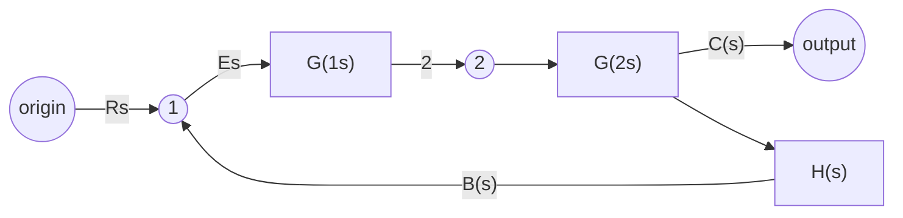
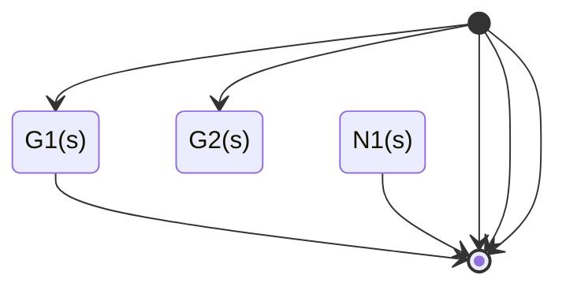

# 第2章 自动控制系统的数学模型

## 备注

考试内容从方框图开始

## Contents

- 2.1 引言
- 2.2 控制系统的时域数学模型
  - 2.2.1 线性元部件、线性系统微分方程的建立
  - 2.2.2 线性微分方程的一般形式
  - 2.2.3 非线性微分方程的线性化
- 2.3 控制系统的复数域数学模型
  - 2.3.1 传递函数
  - 2.3.2 典型环节的传递函数
- 2.4 控制系统结构图
  - 2.4.1 结构图的基本组成及连接形式
  - 2.4.2 结构图等效变换
- 2.5 控制系统信号流图
  - 2.5.1 信号流图
  - 2.5.2 信号流图的绘制
  - 2.5.3 梅森增益公式及运用
- 2.6 闭环系统的传递函数
  - 2.6.1 闭环系统的开环传递函数
  - 2.6.2 闭环系统的闭环传递函数
  - 2.6.3 闭环系统的误差传递函数

## 2.1 引言

- 控制系统的**数学模型**是描述系统输入变量、输出变量以及内部各变量之间关系的数学表达式

- 数学模型应具有：相似性、准确性和简化性

- 数学模型分为：静态模型、动态模型

- 建立模型的两种方法

  - 实验法 / 系统辨识

  - **解析法**

## 2.2 控制系统的时域数学模型

### 2.2.1 线性元部件、线性系统微分方程的建立

### 2.2.2 线性微分方程的一般形式

对于一般线性系统，其动态微分方程的通用形式为
$$
\begin{aligned}
&a_{n} \frac{\mathrm{d}^{n} c(t)}{\mathrm{d} t^{n}}+a_{n-1} \frac{\mathrm{d}^{n-1} c(t)}{\mathrm{d} t^{n-1}}+\cdots+a_{1} \frac{\mathrm{d} c(t)}{\mathrm{d} t}+a_{0} c(t)= \\
&b_{m} \frac{\mathrm{d}^{m} r(t)}{\mathrm{d} t^{m}}+b_{m-1} \frac{\mathrm{d}^{m-1} r(t)}{\mathrm{d} t^{m-1}}+\cdots+b_{1} \frac{\mathrm{d} r(t)}{\mathrm{d} t}+b_{0} r(t)
\end{aligned}
$$


### 2.2.3 非线性微分方程的线性化

## 2.3 控制系统的复数域数学模型

### 2.3.1 传递函数

#### 定义

- 在**零初始条件**下，线性定常系统输出信号 $c(t)$ 的拉氏变换 $C(s)$ 与输入信号 $r(t)$ 的拉氏变换 $R(s)$ 之比，记为 $G(s)$，即
  $$
  \begin{equation}
  G(s)=\frac{\mathscr{L}[c(t)]}{\mathscr{L}[r(t)]}=\frac{C(s)}{R(s)}=\frac{M(s)}{N(s)}=\frac{b_{0} s^{m}+b_{1} s^{m-1}+\cdots+b_{m-1} s+b_{m}}{a_{0} s^{n}+a_{1} s^{n-1}+\cdots+a_{n-1} s+a_{n}}
  \end{equation}
  $$
  

#### 两种标准形式

- 首1标准型，又称零极点式
- 尾1标准型，又称时间常数式

#### 特点

1. 是复变量s的有理真子式
2. 分母多项式等于零，即系统的特征方程
3. 只取决于系统的结构和参数
4. 与系统的微分方程一一对应
5. 传递函数的拉氏反变换即系统的脉冲响应函数

### 2.3.2 典型环节的传递函数

- 环节：按照传递函数形式来分类的元部件
- 下述省略积分方程到传递函数的推导

$$
\begin{matrix}
比例环节(放大)&  \displaystyle G(s)=\frac{C(S)}{R(S)}=K\\
积分环节(无差)&  \displaystyle G(s)=\frac{C(S)}{R(S)}=\frac{1}{Ts}\\
惯性环节(周期)&  \displaystyle G(s)=\frac{C(S)}{R(S)}=\frac{1}{Ts+1}\\
微分环节(超前)&  \displaystyle 理论:G(s)=\frac{C(S)}{R(S)}=Ts  &  \displaystyle 实际:G(s)=\frac{C(S)}{R(S)}=\frac{Ts}{Ts+1}\\
震荡环节&  \displaystyle G(s)=\frac{C(S)}{R(S)}=\frac{1}{T^2s^2+2\xi Ts+1}=\frac{\omega_n^2}{s^2+2\xi \omega_ns+\omega_n^2}  &  \xi 为阻尼比，\omega_n=\frac{1}{T}为无阻尼振荡频率\\
滞后环节(延迟)&  \displaystyle G(s)=\frac{C(S)}{R(S)}=e^{-\tau s}
\end{matrix}
$$

## 2.4 控制系统结构图

### 2.4.1 结构图的基本组成及连接形式

- 用结构图表示的运算都是单向的

1. #### 基本构成

   - 信号线、引出点、比较点/综合点、函数方框/环节方框

2. #### 基本联结形式

   - 串联、并联、反馈

3. 特性

### 2.4.2 结构图等效变换

- 当只讨论系统的输入、输出特性，而不考虑其具体结构时，可以对系统进行变换

#### 五种典型情况

$$
\begin{matrix}
串联环节&G(s)=\prod G_i(s)\\
并联环节&G(s)=\sum G_i(s)\\
反馈环节&\displaystyle \Phi(s)=\frac{C(s)}{R(s)}=\frac{G(s)}{1\pm G(s)H(s)}
&\displaystyle \frac{前向通道传函}{1+开环传递函数}，其中+表示负反馈，-表示正反馈\\
比较点移动\\
引出点移动
\end{matrix}
$$

#### 注意

- 典型连接方式可以直接使用公式化简
- **相邻的相同点**（比较点或引出点）之间**可以互相交换位置或合并**
- **相邻的不同点**（比较点和引出点）之间**不允许交叉移动**
- 相互交叉的支路拉开
- 重叠的支路分开
- 重点是**解环**

## 2.5 控制系统信号流图

### 2.5.1 信号流图

- #### 三种基本图形符号

  - 节点、支路、支路增益

- #### 有关术语

  - 源节点/输入节点、阱节点/输入节点、混合节点；
  - 前向通路、回路、不接触回路；
  - 回路增益、前向通路增益

### 2.5.2 信号流图的绘制

- 根据系统结构图绘制
  - 尽量减少节点数目
  - 若比较点前有引出点，在两点处各设一个节点，分别表示两个变量，两个节点之间的增益为1

- 根据系统方程绘制
  - 画出各方程的信号流图并连接


### 2.5.3 梅森增益公式及运用

任意两个节点之间传递函数的梅森增益公式为
$$
\begin{equation}
G(s)=\frac{1}{\Delta} \sum_{k=1}^{n} P_{\mathrm{k}} \Delta_{\mathrm{k}}
\end{equation}
$$

- 式中，$\Delta$——特征式，其计算公式为

- $$
  \begin{equation}
  \Delta=1-\sum L_{\mathrm{a}}+\sum L_{\mathrm{b}} L_{\mathrm{c}}-\sum L_{\mathrm{d}} L_{\mathrm{e}} L_{\mathrm{f}}+\cdots
  \end{equation}
  $$

- $\sum L_a$——信号流图中所有单独回路的增益之和；

- $\sum L_bL_c$——所有两两互不接触回路的回路增益乘积之和；

- $\sum L_dL_eL_f$——所有互不接触回路中，每次取其中三个回路增益的乘积之和；

- $n$——从输入节点到输出节点间前向通路的条数；

- $P_k$——从输入节点到输出节点间第k条前向通路的总增益；

- $\Delta_k$——第k条前向通路的余子式，即把特征式$\Delta $中与该前向通路相接触回路的回路增益置为零后所余下的部分。

## 2.6 闭环系统的传递函数


$R(s)$表示控制输入信号，$N(s)$表示干扰信号，$C(s)$表示系统输出，$E(s)$表示误差信号

### 2.6.1 闭环系统的开环传递函数

$$
G(s)H(s)=\frac{B(s)}{E(s)}=G_1(S)G_2(s)H(s)
$$

### 2.6.2 闭环系统的闭环传递函数

$$
\begin{matrix}
闭环传递函数  &  令N(s)=0  &  \displaystyle \Phi(s)=\frac{C(s)}{R(s)}=\frac{G_1(S)G_2(s)}{1+G_1(S)G_2(s)H(s)}  \\
输出对扰动作用的传递函数  &  令R(s)=0  &  \displaystyle \Phi_n(s)=\frac{C(s)}{N(s)}=\frac{G_2(s)}{1+G_1(S)G_2(s)H(s)}  \\
系统的总输出  &  根据叠加定理联立上述两式  &  \displaystyle C(s)=\frac{G_1(S)G_2(s)R(s)}{1+G_1(S)G_2(s)H(s)}+\frac{G_2(S)N(s)}{1+G_1(S)G_2(s)H(s)}
\end{matrix}
$$

### 2.6.3 闭环系统的误差传递函数

$$
\begin{matrix}
误差传递函数  &  令N(s)=0  &  \displaystyle \Phi_e(s)=\frac{E(s)}{R(s)}=\frac{1}{1+G_1(S)G_2(s)H(s)}  \\
扰动误差传递函数  &  令R(s)=0  &  \displaystyle \Phi_{en}(s)=\frac{E(s)}{N(s)}=\frac{-G_2(s)H(s)}{1+G_1(S)G_2(s)H(s)}  \\
在控制和扰动同时作用下系统的总误差  &  联立上述两式  &  \displaystyle E(s)=\frac{R(s)}{1+G_1(S)G_2(s)H(s)}+\frac{-G_2(S)H(s)N(s)}{1+G_1(S)G_2(s)H(s)}  \\
特征多项式  &  四种传函的分母多项式  &  1+G(s)H(s)=0  
\end{matrix}
$$


## 拓展

### 使用`Mermaid`语法绘制程序框图

- 可以直接以文本形式在.md文件内渲染，不用将图片上传图床
- 没有符合程序框图的样式

#### `flowchart`

- 线形不够整齐
- 标注方式是否能放在直线上？
- 线方正？
- `(` `)` 等特殊符号可以通过用`"` `"` 括起整段文字打出



#### `stateDiagram`

- 点的定义？
- 方向修改




#### 流程图

~~~mermaid
```flow
flowchat
  st=>start: Start
  op=>operation: Your Operation
  cond=>condition: Yes or No?
  e=>end
  st->op->cond
  cond(yes)->e
  cond(no)->op
​```
~~~

[(1条消息) 【已解决】markdown使用mermaid绘制流程图，报错[Expecting ‘open_directive’, ‘NEWLINE‘, ‘SPACE‘, ‘GRAPH‘, got ‘ALPHA‘\]_木木归来的博客-CSDN博客](https://blog.csdn.net/cc920095705/article/details/113769741)

#### 参考资料：

[mermaid-js/mermaid: Generation of diagram and flowchart from text in a similar manner as markdown (github.com)](https://github.com/mermaid-js/mermaid)

[Mermaid，就像用 Markdown 码字一样，高效制作简易流图 - 少数派 (sspai.com)](https://sspai.com/post/63055#!)

[(5条消息) Mermaid 实用教程_平头某的博客-CSDN博客_mermaid](https://blog.csdn.net/fenghuizhidao/article/details/79440583)

[(5条消息) Markdown里面使用mermaid画流程图（基础）_Subson的博客-CSDN博客_markdown 画图](https://blog.csdn.net/Subson/article/details/78054689?spm=1001.2101.3001.6661.1&utm_medium=distribute.pc_relevant_t0.none-task-blog-2~default~CTRLIST~default-1-78054689-blog-79440583.pc_relevant_scanpaymentv1&depth_1-utm_source=distribute.pc_relevant_t0.none-task-blog-2~default~CTRLIST~default-1-78054689-blog-79440583.pc_relevant_scanpaymentv1&utm_relevant_index=1)

[(1条消息) Markdown里面的流程图_Subson的博客-CSDN博客_idea markdown 流程图](https://blog.csdn.net/Subson/article/details/75126945)

[(5条消息) Mermaid画图教程（一）_CofCai的博客-CSDN博客_mermaid画图](https://blog.csdn.net/weixin_44360592/article/details/109526990)

### 使用`draw.io`画图

- 简单
- 可以保存并直接修改`.svg`文件，导出格式多样全面
- 图片嵌入需要上传图床
